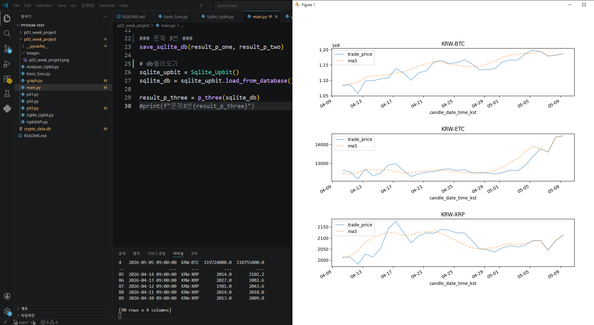

#프로젝트 목록
- **[1주차 프로젝트](#1주차-프로젝트)**
- **[2주차 프로젝트](#2주차-프로젝트)**

# **1주차 프로젝트**
- 📌 **[1주차 핵심 프로젝트 보기](#06-daily-report-portfolio)**
<details>
<summary>📦 1~5번 프로젝트 보기</summary>

### **01 Cryptocurrency Portfolio Analyzer**
: 암호화폐 포트폴리오 분석기

#### **내용**
- 업비트 API를 활용하여 암호화폐 포트폴리오의 현재 가치와 자산 비중을 분석합니다.
- 보유 중인 코인의 실시간 가격을 조회하고, 총 자산 가치 및 종목별 비중을 표 형태로 출력합니다.

#### **사용 기술**
- Python
- requests : HTTP API 요청
- REST API 연동
- JSON 데이터 처리

#### **프로젝트 진행 중 배운 점**
- 외부 API 데이터를 Python으로 가져오는 방법
- JSON 응답 데이터를 원하는 형태로 가공하는 방법
- 딕셔너리와 리스트를 활용한 데이터 관리
- 함수로 역할을 분리하여 코드 구조화하기

### **02 Price Alert System** 
: 가격 알림 시스템

#### **내용**
- 업비트 API를 활용하여 특정 암호화폐의 현재 가격을 주기적으로 조회하고, 설정한 상한가 / 하한가 목표값 도달 여부를 **실시간**으로 확인합니다.

#### **사용 기술**
- Python
- requests : HTTP API 요청
- REST API 연동
- JSON 데이터 처리
- datetime : 현재 시간 출력

#### **프로젝트 진행 중 배운 점**
- **실시간** API 데이터를 반복적으로 가져오는 방법
- 일정 시간 간격으로 프로그램 실행하기 (sleep)
- 현재 시간 포맷 출력 방법
- 조건문을 활용한 알림 시스템 구현

### **03 Cryptocurrency Return Calculator** 
: 암호화폐 수익률 계산기

#### **내용**
- 업비트 API를 활용하여 과거 특정 시점에 암호화폐에 투자했을 경우,현재 기준으로 얼마의 수익 또는 손실이 발생했는지 계산합니다.
- 과거 가격 데이터를 조회하여 구매 수량을 계산하고, 현재 가치·손익·수익률을 확인할 수 있습니다.

#### **사용 기술**
- Python
- requests : HTTP API 요청
- REST API 연동
- JSON 데이터 처리

#### **프로젝트 진행 중 배운 점**
- 과거 시세 데이터를 API로 가져오는 방법

### **04 Cryptocurrency Compare Analysis** 
: 여러 암호화폐 수익률 비교 분석기

#### **내용**
- 업비트 API를 활용하여 여러 암호화폐의 현재 가격과 과거 가격을 비교합니다.
- 지정한 기간 동안의 수익률을 계산하고, 수익률이 높은 순서대로 정렬합니다.
- 가장 많이 상승한 코인과 가장 많이 하락한 코인을 확인할 수 있습니다.

#### **사용 기술**
- Python
- requests : HTTP API 요청
- REST API 연동
- JSON 데이터 처리
- sort 정렬 
- lambda함수

#### **프로젝트 진행 중 배운 점**
- sort()와 lambda를 활용한 정렬 방법

### **05 Analysis Visual** 
: 이동평균선 기반 가격 분석 + 시각화

#### **내용**

- 업비트 API를 활용하여 암호화폐의 최근 가격 데이터를 가져옵니다.
- pandas를 사용해 5일 이동평균선과 10일 이동평균선을 계산합니다.
- matplotlib을 활용하여 종가, 5일선, 10일선을 차트로 시각화합니다.
- 5일선과 10일선의 마지막 값을 비교하여 단기 상승/하락 흐름을 판단합니다.

#### **사용 기술**
- Python
- requests : HTTP API 요청
- REST API 연동
- JSON 데이터 처리
- pandas : 데이터프레임 생성 및 이동평균 계산
- matplotlib : 가격 데이터 시각화
- rolling() : 이동평균선 계산

#### **프로젝트 진행 중 배운 점**
- pandas DataFrame을 활용하여 데이터를 관리하는 방법
- rolling().mean()으로 이동평균선을 계산하는 방법
- matplotlib으로 가격 차트를 그리는 방법

</details>

### **06 Daily Report Portfolio** 
BTC의 최근 7일 가격변화를 plot으로 시각화한 결과입니다.


#### **내용**
- 오늘 기준 총 포트폴리오 가치 확인
- 보유 코인중 현재 가치 비율이 가장 높은 코인 조회
- 최근 7일 기준 가장 많이 오른 코인 조회
- 특정 코인 1개의 최근 7일 가격 추이 그래프 확인

#### 🧩각 클래스의 역할

| 클래스 | 역할 |
|--------|------|
| UPbit | API 데이터 수집 |
| Analyzer_Portfolio | 포트폴리오 분석 및 계산 |
| Print_Message | 결과 출력 |
| Graph | 데이터 그래프 |
| main | 전체 흐름 제어 및 실행 |

#### **사용 기술**
- Python
- requests : HTTP API 요청
- REST API : Upbit Open API 연동
- JSON 데이터 처리
- pandas : 데이터프레임 생성 및 이동평균 계산
- matplotlib : 가격 데이터 시각화
- **객체 지향 프로그래밍(OOP)**
: API를 이용한 데이터수집 / 분석 / 그래프 / 출력 / main 으로 각각 5개의 클래스단위로 분리
(UPbit/ Analyzer_Portfolio / Graph / Print_Message / main)

- **모듈화**
: 기능별로 py파일을 분리, main.py에서 각 클래스 제어

#### **프로젝트 진행 중 배운 점**
- max() 함수에서 key=lambda를 사용하는 방법
- API 응답 데이터를 가공하는 방법
- **객체 지향 프로그래밍(OOP)**을 통해 각 클래스의 역할을 분리하고, 그에 맞게 코드를 구조화하고 main에서 전체 흐름을 제어하는 방법 
- **모듈화**를 통해 각 클래스의 역할을 설정하고, 그에 맞게 메서드 분리하는 설계
- 분리된 함수와 메서드를 재사용하여 코드의 유지보수성과 확장성을 높이는 방법
- SQLite DB에 저장된 날짜 컬럼이 문자열(`str`)로 불러와질 수 있으며, `pd.to_datetime()`으로 다시 `datetime` 형식으로 변환해야 한다는 점
- Pandas `groupby()`를 활용하여 종목별로 데이터를 그룹화하고, 이를 기반으로 그래프를 생성하는 방법

# **2주차 프로젝트**

## 📈 실행 결과
BTC, ETC, XRP의 거래 가격과 5일 이동평균을 subplot으로 시각화한 결과입니다.


#### 프로젝트 1 : 가격 변동 계산
: 암호화폐의 가격 변동과 변동률, 일일 가격 변동 폭을 계산합니다.

#### 프로젝트 2 : 5일 이동평균 계산 및 결측치 처리
: 종가를 기준으로 암호화폐 마다 5일 이동 평균을 계산합니다.
결측치는 해당 날짜의 종가로 대체합니다.

#### 프로젝트 3 : 프로젝트(1+2) 데이터의 시각화
: 암호화폐별 데이터를 날짜순으로 정렬하고, subplot을 이용하여 그래프를 한 화면에서 볼 수 있도록 합니다.

#### **사용 기술**
- Python
- Pandas
- requests
- matplotlib
- Upbit API
- SQLite3(sqlite3 module)
- **객체 지향 프로그래밍(OOP)**
: API 데이터 수집(class UpbitAPI) / 분석&계산(class Analyzer_Upbit) / 유틸함수(basic_func.py ) / 그래프(graph.py) / 1번 프로젝트(p01.py) / 2번 프로젝트(p02.py) / 3번 프로젝트(p03.py) / 전체 프로그램 실행(main) 으로 각각 기능 분리
- **모듈화**를 통해 각 클래스의 역할을 설정하고, 그에 맞게 메서드 분리하는 설계

#### **프로젝트 진행 중 배운 점**
- Pandas DataFrame 생성 및 칼럼 생성 및 선택
- DataFrame 병합
- 날짜 데이터 datetime 변환 및 포맷팅
- 암호화폐별 그룹화
- rolling()을 이용한 이동평균 계산
- 결측치 데이터 대체 방법
- Pandas의 subplot을 이용한 그래프의 시각화
- 객체 지향 프로그래밍(OOP) 설계
- 모듈화를 통한 역할 분리

## 프로젝트의 구조

```text
p02_week_project/
│
├── main.py
├── UpbitAPI.py
├── Analyzer_Upbit.py
├── basic_func.py
├── graph.py
├── p01.py
├── p02.py
├── p03.py
```

## 실행 환경

- Python 3.14

## 실행 방법
```bash
pip install pandas requests matplotlib
python main.py
```

## 🧩 파일 및 함수별 역할

### `UpbitAPI.py`

| 클래스 / 함수 | 역할 |
|---|---|
| `class UpbitAPI` | Upbit API를 통해 데이터를 요청하고 받아옵니다. |
| `get_current_prices()` | 현재가를 조회합니다. |
| `get_krw_tickers()` | KRW 마켓 페어 목록을 조회합니다. |
| `get_candle_data()` | 일 캔들 데이터를 조회합니다. |
| `get_multi_candle_data()` | 여러 암호화폐의 일 캔들 데이터를 조회합니다. |

### `Analyzer_Upbit.py`

| 클래스 / 함수 | 역할 |
|---|---|
| `class Analyzer_Upbit` | API 응답 데이터를 이용해 필요한 계산을 합니다. |
| `get_price_change()` | 종가 - 시가를 계산합니다. |
| `get_price_change_pct()` | 변동률을 계산합니다. |
| `get_high_low_diff()` | 일일 변동 가격 폭을 계산합니다. |

### `basic_func.py`

| 함수 | 역할 |
|---|---|
| `conversion_df()` | 데이터를 DataFrame으로 변환합니다. |
| `error_handling()` | url, params, headers를 받아 GET 요청을 수행하고 예외 처리 후 데이터를 반환합니다. |
| `conversion_datetime()` | 날짜를 datetime 형식으로 변환합니다. |
| `formatting_time()` | 그래프 x축 날짜를 `%m-%d` 형식으로 포맷팅합니다. |
| `save_sqlite_db()` | 두 개의 DataFrame을 병합하여 SQLite DB에 저장합니다. |

### `graph.py`

| 함수 | 역할 |
|---|---|
| `graph()` | ticker별 거래가격과 5일 이동평균을 한 화면의 subplot 그래프로 보여줍니다. |

### `p01.py`

| 함수 | 역할 |
|---|---|
| `p_one()` | 거래 날짜, ticker, 종가-시가, 변동률, 일일 변동 가격 폭 컬럼을 생성합니다. |

### `p02.py`

| 함수 | 역할 |
|---|---|
| `p_two()` | ticker별 거래 가격을 이용해 5일 이동평균을 계산하고 필요한 컬럼을 반환합니다. |
| `calculate_isnull()` | ticker별 5일 이동평균을 계산하고 결측치를 해당 날짜의 거래 가격으로 대체합니다. |

### `p03.py`

| 함수 | 역할 |
|---|---|
| `p_three()` | 데이터를 ticker와 날짜 순으로 정렬한 뒤 ticker별로 그룹화하여 그래프로 보여줍니다. |

### `main.py`

| 실행 흐름 | 역할 |
|---|---|
| `p_one()` | 1번 프로젝트를 실행합니다. |
| `p_two()` | 2번 프로젝트를 실행합니다. |
| `conversion_datetime()` | 날짜 컬럼을 datetime 형식으로 변환합니다. |
| `save_sqlite_db()` | 1번, 2번 결과 DataFrame을 병합하여 SQLite DB에 저장합니다. |
| `p_three()` | db에서 불러온 데이터로 3번 프로젝트를 실행합니다. |
